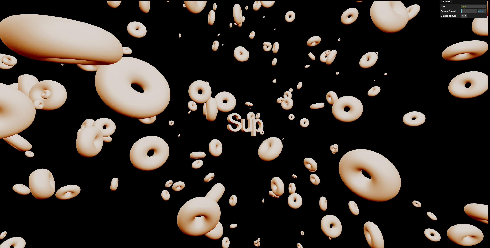

# sup

A modular 3D experience built with React Three Fiber, featuring a cinematic zoom-in camera, dynamic 3D text, matcap materials, and a field of floating donuts. Includes a debug UI and URL parameter support for full configurability.

## Preview



## Features

- Cinematic fly-in camera intro
- 3D text generated from URL or GUI input
- Randomized donut mesh field
- Matcap texture selection (1–8)
- `lil-gui` debug panel
- Gear icon toggle for GUI
- Syncs settings (text, matcap, speed) with URL params
- Modular TypeScript architecture

## Controls

- Double-click anywhere to enter fullscreen
- Click the gear icon in the top-right to toggle the debug panel
- Modify text, speed, and matcap live using the panel

## Run it locally

Clone the repo and install dependencies:

```bash
git clone https://github.com/nullsploit01/sup.git
cd sup
npm install
npm run dev
```
